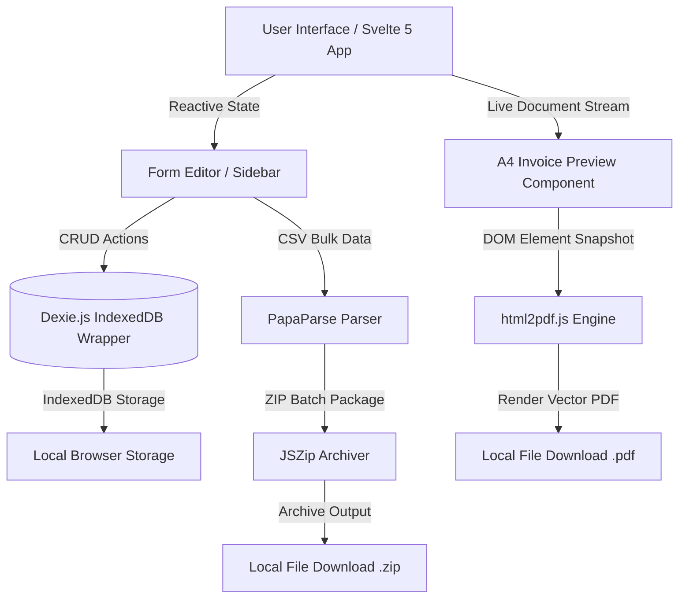

# 🧾 Workflare Invoicing — Enterprise-Grade Privacy-First Invoicing Engine


-059669?style=for-the-badge&logo=sqlite&logoColor=white)


[](https://invoicing.workflare.in)

**Live Demo**: [invoicing.workflare.in](https://invoicing.workflare.in)

**Workflare Invoicing** is a high-performance, privacy-focused, zero-backend Web Application designed for technology consultants, independent contractors, agencies, and billing professionals. Engineered with **Svelte 5**, **Vite**, and **IndexedDB (Dexie.js)**, Workflare provides instant A4 vector PDF generation, client management, dual e-signature authorization, and bulk CSV batch processing — operating **100% inside your browser runtime**.

---

## 📑 Table of Contents

- [✨ Core Capabilities](#-core-capabilities)
- [🏛️ System Architecture](#️-system-architecture)
- [💾 Data Persistence Schema (Dexie.js)](#-data-persistence-schema-dexiejs)
- [📁 Project Directory Structure](#-project-directory-structure)
- [🚀 Quick Start & Development](#-quick-start--development)
- [🛠️ Production Build & Deployment](#️-production-build--deployment)
- [🛡️ Security, Privacy & Zero-Cloud Guarantee](#️-security-privacy--zero-cloud-guarantee)
- [🗺️ Codebase Audit & Architectural Roadmap](#️-codebase-audit--architectural-roadmap)
- [📄 License & Author](#-license--author)

---

## ✨ Core Capabilities

### ⚙️ 1. Business & Issuer Master Profile
- **Enterprise Identity**: Configure company name, brand tagline, logo, tax registration number (GSTIN / VAT / EIN / SSN), official email, phone, website, and multi-line physical address.
- **Financial Banking Ledger**: Store beneficiary entity, financial institution name, account number, SWIFT / BIC / IFSC codes, and UPI virtual payment addresses.
- **Custom Branding Assets**: Custom vector branding (`logo.svg`) for app UI and favicon, with uploaded image/base64 support for generated invoice documents.
- **Digital Issuer E-Signatures**: Supports both stylized cursive font-rendered signatures and high-resolution uploaded image signatures.

### 👥 2. Client Relationship Directory (CRM)
- **Persistent Client Database**: Store unlimited client contact records locally with instant search, auto-fill, and profile management.
- **One-Click Invoice Auto-Population**: Select any saved client to instantly populate billing contacts, billing address, and tax registration IDs.
- **Client Signature Verification**: Supports dual-signatory workflows with client typed cursive signatures, designated signee names, and official titles.

### 📝 3. Live Editor & Vector PDF Engine
- **WYSIWYG Live Preview**: Real-time side-by-side editing where line items, sub-notes, quantities, and rates update the printable preview dynamically.
- **Automated Financial Calculations**: Auto-calculates item totals, subtotal, configurable GST/VAT tax rates, and final grand balance.
- **Client-Side Vector PDF Export**: Generates crisp, single-page or multi-page A4 PDFs via `html2pdf.js` directly within the client machine without external API rendering.
- **Status Indicator Badges**: Toggle invoice statuses (`PAID`, `UNPAID / DUE`, `OVERDUE`, `DRAFT`) with visual CSS badges.

### 📂 4. Bulk Operations & Data Mobility
- **Structured CSV Import/Export**: Parse bulk invoice lines or export database tables into standardized CSV structures via `PapaParse`.
- **ZIP Batch Export**: Package multiple invoice records into a single compressed `.zip` archive via `JSZip`.
- **Database Reset & Backup**: Complete control to reset, back up, or wipe local IndexedDB state at any time.

---

## 🏛️ System Architecture

Workflare Invoicing operates completely on the client side. There are no remote application servers, database connections, or serverless functions involved in generating or saving invoices.



### Tech Stack Breakdown

| Subsystem | Technology | Purpose & Rationale |
| :--- | :--- | :--- |
| **Frontend Framework** | [Svelte 5](https://svelte.dev/) | Ultra-lean, compile-time reactive component framework ensuring near-zero bundle footprint. |
| **Build System** | [Vite 5](https://vitejs.dev/) | Lightning-fast HMR dev server & optimized multi-page Rollup bundler. |
| **Local Database** | [Dexie.js](https://dexie.org/) | Minimalist wrapper for browser IndexedDB providing transactional ACID storage. |
| **PDF Generation** | [html2pdf.js](https://github.com/eKoopmans/html2pdf.js) | Combines HTML2Canvas & jsPDF to convert live DOM nodes into vector PDF documents. |
| **CSV Engine** | [PapaParse](https://www.papaparse.com/) | Fast, multi-threaded CSV parsing and stringifying for data migration. |
| **Archiver** | [JSZip](https://stuk.github.io/jszip/) | Client-side compression for multi-invoice batch exports. |
| **Vector Icons** | [Lucide Svelte](https://lucide.dev/) | Accessible, consistent icon system built for modern UI components. |

---

## 💾 Data Persistence Schema (Dexie.js)

All local database transactions are managed through Dexie.js under the database identifier `InvoiceGeneratorDB`.

### Database Schema Definition (`src/lib/db.js`)

```javascript
db.version(1).stores({
  settings: 'id',                                               // Key: 'company_settings'
  clients:  '++id, name, email, company',                       // Indexed fields
  invoices: '++id, invoiceNumber, clientId, date, dueDate, status', // Indexed fields
  items:    '++id, name, rate'                                  // Quick item lookups
});
```

### Primary Model Entities

#### 1. Settings Entity (`company_settings`)
```typescript
interface CompanySettings {
  id: string;                    // 'company_settings'
  companyName: string;           // e.g. "Nexus Systems LLC"
  companyTagline: string;        // e.g. "Cloud Infrastructure & Enterprise Solutions"
  ownerName: string;             // Owner / Issuer Name
  ownerTitle: string;            // Official Designation
  email: string;                 // Official Billing Email
  phone: string;                 // Contact Telephone Number
  website: string;               // URL string
  address: string;               // Physical Address
  cityStateZip: string;          // City, Region & Postal Code
  taxId: string;                 // GSTIN / VAT / EIN Registration Number
  beneficiaryName: string;       // Banking Beneficiary Name
  bankName: string;              // Financial Institution
  accountNumber: string;         // Account Number
  ifscCode: string;              // Routing / SWIFT / IFSC Code
  upiId: string;                 // Virtual Payment Address
  logoUrl: string;               // Base64 Data URL or SVG Path
  defaultCurrency: string;       // Currency code ('INR', 'USD', 'EUR', 'GBP')
  currencySymbol: string;        // Currency symbol ('₹', '$', '€', '£')
  defaultTaxRate: number;        // Standard tax rate percentage (e.g. 18)
  paymentTerms: string;          // Payment terms statement
  issuerSignatureType: string;   // 'text' | 'image' | 'none'
  issuerSignatureText: string;   // Cursive rendered signature text
  issuerSignatureImage: string;  // Base64 encoded image string
}
```

#### 2. Invoice Document Entity
```typescript
interface InvoiceDocument {
  id?: number;                   // Auto-increment primary key
  invoiceNumber: string;         // Unique Invoice Identifier (e.g. "INV-2026-001")
  clientId?: number;             // Associated saved client ID reference
  clientName: string;            // Contact Person Name
  clientCompany: string;         // Billing Organization Name
  clientEmail: string;           // Client Email Address
  clientPhone: string;           // Client Phone Number
  clientTaxId: string;           // Client GSTIN / Tax Identification Number
  clientAddress: string;         // Client Billing Street Address
  date: string;                  // Issue Date (ISO string 'YYYY-MM-DD')
  dueDate: string;               // Due Date (ISO string 'YYYY-MM-DD')
  periodFrom?: string;           // Retainer Period Start ('YYYY-MM-DD')
  periodTo?: string;             // Retainer Period End ('YYYY-MM-DD')
  status: 'PAID' | 'UNPAID' | 'NONE'; // Payment Status Flag
  currencyKey: string;           // 'INR' | 'USD' | 'EUR' | 'GBP'
  currencySymbol: string;        // '₹' | '$' | '€' | '£'
  taxRate: number;               // Applicable Tax Percentage
  items: Array<{
    description: string;         // Scope / Item title
    subText?: string;            // Additional line item details
    quantity: number;            // Hours or Quantity
    rate: number;                // Hourly or Unit Rate
  }>;
  clientSignatureType: string;   // 'text' | 'image' | 'none'
  clientSignatureText?: string;  // Cursive signature string
  clientSignatureImage?: string; // Base64 signature image
  clientSignatureName?: string;  // Signatory Name
  clientSignatureDesignation?: string; // Signatory Title
}
```

---

## 📁 Project Directory Structure

```
Invoice-generator/
├── index.html                    # High-converting Landing Page & Product Showcase
├── app.html                      # Workspace Application Entry Point
├── logo.svg                      # Master SVG Brand Logo Asset
├── package.json                  # Dependencies & Script Runners
├── vite.config.js                # Multi-Page Vite & Rollup Configuration
├── public/
│   └── logo.svg                  # Favicon & Static Branding Asset
│
└── src/
    ├── App.svelte                # Core Application Orchestrator Component
    ├── main.js                   # Application Mount Bootstrap Point
    ├── app.css                   # Global CSS Tokens, Variables & Utilities
    └── lib/
        ├── db.js                 # Dexie IndexedDB Schema & Initializers
        ├── csvUtils.js           # CSV Import/Export & ZIP Utility Functions
        ├── components/
        │   ├── Header.svelte     # App Workspace Navbar & Action Controls
        │   ├── Sidebar.svelte    # Invoice Form Controls & Saved Invoices Drawer
        │   ├── InvoicePreview.svelte # Container for Printable Invoice Document
        │   ├── ClientManager.svelte  # Client Directory Modal
        │   ├── SettingsModal.svelte  # Business Settings & Signature Configuration
        │   └── BulkCsvModal.svelte   # Bulk CSV Import/Export Modal
        └── templates/
            └── VanillaTemplate.svelte # Pixel-Perfect Printable A4 CSS Document Template
```

---

## 🚀 Quick Start & Development

### Prerequisites
- **Node.js**: `v18.0.0` or higher
- **Package Manager**: `npm` (v9+) or `pnpm`

### 1. Clone Repository & Install Dependencies
```bash
# Navigate to the workspace directory
cd /Users/godarayudhvir/Projects/Invoice-generator

# Install dependencies
npm install
```

### 2. Run Local Development Server
```bash
npm run dev
```
The application will launch automatically at `http://localhost:3000`.
- **Landing Page**: `http://localhost:3000/index.html`
- **Application Workspace**: `http://localhost:3000/app.html`

---

## 🛠️ Production Build & Deployment

### Build for Production
To bundle the application into static, minified HTML/JS/CSS assets:
```bash
npm run build
```
Output files will be generated inside the `dist/` directory:
- `dist/index.html`
- `dist/app.html`
- `dist/assets/`

### Preview Production Build
```bash
npm run preview
```

### Static Hosting Compatibility
Because **Workflare Invoicing** is a 100% client-side application, the built `dist/` directory can be deployed instantly to any static hosting service:
- **GitHub Pages**: Deploy `dist/` branch via GitHub Actions.
- **Cloudflare Pages**: Connect your repository and configure the build settings as follows:
  * **Framework Preset**: `Svelte`
  * **Build Command**: `npm run build`
  * **Build Output Directory**: `dist`
- **Vercel / Netlify**: Connect repo with build command `npm run build` and output directory `dist`.

---

## 🛡️ Security, Privacy & Zero-Cloud Guarantee

Unlike traditional cloud SaaS platforms that transmit sensitive banking details, client contact lists, and transaction amounts across third-party cloud servers, Workflare Invoicing is engineered around **Zero-Cloud Architecture**:

1. **Zero External API Dependencies**: No remote servers process your data.
2. **Local Browser Database**: All database tables reside inside your browser's persistent IndexedDB sandbox.
3. **No Telemetry & No Tracking**: Zero analytics scripts, tracking pixels, or third-party cookies.
4. **Air-Gapped Operation**: Once loaded in your browser, the application functions seamlessly even without an active internet connection.

---

## 🗺️ Codebase Audit & Architectural Roadmap

### Key Future Enhancements

#### 1. 🎨 Multi-Template Rendering Engine
- Extend `src/lib/templates/` with additional printable themes (*Corporate Classic*, *Modern Minimalist*, *Creative Dual-Tone*).

#### 2. 🌐 Auto Internationalization (i18n) & Localization
- Add `Intl.NumberFormat` ISO currency formatting support for automated comma grouping and currency symbol placement based on client region.

#### 3. 📊 Analytics Dashboard
- Add local visual revenue charts (Paid vs. Pending Retainers, Monthly Revenue Breakdown) calculated directly from `db.invoices`.

#### 4. 📲 Progressive Web App (PWA) Offline Support
- Integrate `vite-plugin-pwa` to enable background service workers and home-screen app installation on iOS and Android devices.

---

## 📄 License & Author

**Workflare Invoicing Engine** is open-source software licensed under the **MIT License**.

Designed and developed for privacy-conscious developers, contractors, and agencies.
