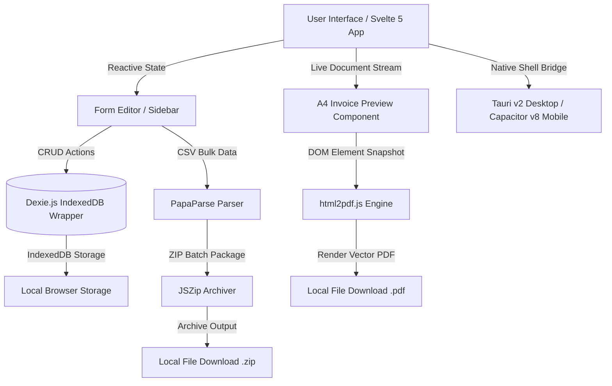

# 🧾 Workflare Invoicing — Enterprise-Grade Privacy-First Invoicing Engine


-059669?style=for-the-badge&logo=sqlite&logoColor=white)

-24c8db?style=for-the-badge&logo=tauri&logoColor=white)
-119afb?style=for-the-badge&logo=capacitor&logoColor=white)


[](https://invoicing.workflare.in)

**Live Demo**: [invoicing.workflare.in](https://invoicing.workflare.in)

**Workflare Invoicing** is a high-performance, privacy-focused, zero-backend Web Application, Progressive Web App (PWA), and Cross-Platform Native Application (macOS, Windows, Android, iOS) designed for technology consultants, independent contractors, agencies, and billing professionals. Engineered with **Svelte 5**, **Vite**, **VitePWA**, **Tauri v2**, **Capacitor v8**, and **IndexedDB (Dexie.js)**, Workflare provides instant A4 vector PDF generation, client management, dual e-signature authorization, and bulk CSV batch processing — operating **100% inside your local device runtime**.

---

## 📑 Table of Contents

- [✨ Core Capabilities](#-core-capabilities)
- [📱 Desktop & Mobile Native Apps](#-desktop--mobile-native-apps)
- [🏛️ System Architecture](#️-system-architecture)
- [💾 Data Persistence Schema (Dexie.js)](#-data-persistence-schema-dexiejs)
- [📁 Project Directory Structure](#-project-directory-structure)
- [🚀 Quick Start & Development](#-quick-start--development)
- [🛠️ Production Build & CI/CD Workflows](#️-production-build--cicd-workflows)
- [🛡️ Security, Privacy & Zero-Cloud Guarantee](#️-security-privacy--zero-cloud-guarantee)
- [📄 License & Author](#-license--author)

---

## ✨ Core Capabilities

### ⚡ 1. Progressive Web App (PWA) & Offline Capabilities
- **Installable Desktop/Mobile App**: Install directly from Chrome, Edge, or Safari as a standalone desktop or mobile web application.
- **Service Worker Pre-Caching**: Full offline functionality via `vite-plugin-pwa` caching all static assets, application bundles, local fonts, and Google Fonts.
- **Live Update Banners**: In-app Service Worker registration (`PwaRegister.svelte`) that prompts users when a new software version is available.

### ⚙️ 2. Business & Issuer Master Profile
- **Enterprise Identity**: Configure company name, brand tagline, logo, tax registration number (GSTIN / VAT / EIN / SSN), official email, phone, website, and multi-line physical address.
- **Financial Banking Ledger**: Store beneficiary entity, financial institution name, account number, SWIFT / BIC / IFSC codes, and UPI virtual payment addresses.
- **Custom Branding Assets**: Custom vector branding (`logo.svg`) for app UI and favicon, with uploaded image/base64 support for generated invoice documents.
- **Digital Issuer E-Signatures**: Supports both stylized cursive font-rendered signatures and high-resolution uploaded image signatures.

### 👥 3. Client Relationship Directory (CRM)
- **Persistent Client Database**: Store unlimited client contact records locally with instant search, auto-fill, and profile management.
- **One-Click Invoice Auto-Population**: Select any saved client to instantly populate billing contacts, billing address, and tax registration IDs.
- **Client Signature Verification**: Supports dual-signatory workflows with client typed cursive signatures, designated signee names, and official titles.

### 📝 4. Live Editor & Vector PDF Engine
- **WYSIWYG Live Preview**: Real-time side-by-side editing where line items, sub-notes, quantities, and rates update the printable preview dynamically.
- **Automated Financial Calculations**: Auto-calculates item totals, subtotal, configurable GST/VAT tax rates, and final grand balance.
- **Client-Side Vector PDF Export**: Generates crisp, single-page or multi-page A4 PDFs via `html2pdf.js` directly within the client machine without external API rendering.
- **Status Indicator Badges**: Toggle invoice statuses (`PAID`, `UNPAID / DUE`, `OVERDUE`, `DRAFT`) with visual CSS badges.

### 📂 5. Bulk Operations & Data Mobility
- **Structured CSV Import/Export**: Parse bulk invoice lines or export database tables into standardized CSV structures via `PapaParse`.
- **ZIP Batch Export**: Package multiple invoice records into a single compressed `.zip` archive via `JSZip`.
- **Database Reset & Backup**: Complete control to reset, back up, or wipe local IndexedDB state at any time.

---

## 📱 Desktop & Mobile Native Apps

Workflare Invoicing is available across all major operating systems:

| Platform | Technology | Output Binaries |
| :--- | :--- | :--- |
| **Web / PWA** | `vite-plugin-pwa` + Workbox | Web App Manifest + Offline Service Worker (`sw.js`) |
| **macOS** | Tauri v2 (Rust shell) | `.dmg` Installer & `.app` Bundle |
| **Windows** | Tauri v2 (Rust shell) | `.msi` Installer & `.exe` Standalone Executable |
| **Android** | Capacitor v8 (Native Gradle) | `.apk` Debug Package & `.aab` Release Bundle |
| **iOS** | Capacitor v8 (Xcode / Swift) | `.app` Xcode Archive Package |

### Automated CI/CD Workflows (GitHub Actions)
Every commit pushed to `main` triggers automated GitHub Actions build pipelines:
- **`build-desktop.yml`**: Compiles macOS (`.dmg`/`.app`) and Windows (`.msi`/`.exe`) apps on `macos-latest` and `windows-latest` runners.
- **`build-mobile.yml`**: Compiles Android (`.apk`/`.aab`) and iOS packages using JDK 17, Xcode, and Node.js 22 LTS.

Download compiled application binaries directly from [GitHub Actions Run Artifacts](https://github.com/workflareindia/workflare-invoicing/actions).

### 📥 Download Latest Release

[](https://github.com/workflareindia/workflare-invoicing/releases/download/v1.0.0/app-debug.apk)
[](https://github.com/workflareindia/workflare-invoicing/releases/download/v1.0.0/WorkflareInvoicing-iOS.ipa)
[](https://github.com/workflareindia/workflare-invoicing/releases/download/v1.0.0/WorkflareInvoicing_1.0.0_aarch64.dmg)
[](https://github.com/workflareindia/workflare-invoicing/releases/download/v1.0.0/WorkflareInvoicing_1.0.0_x64-setup.exe)
[](https://invoicing.workflare.in/app.html)

### macOS Gatekeeper Security Notice
When installing the macOS app (`.dmg` or `.app`) built via GitHub Actions without a paid Apple Developer Certificate, macOS Gatekeeper may present a security prompt stating that *"WorkflareInvoicing.app is damaged and can’t be opened"*. 

To clear the web quarantine attribute and open the application, execute this command in your Mac Terminal:

```bash
sudo xattr -rd com.apple.quarantine /Applications/WorkflareInvoicing.app
```

---

## 🏛️ System Architecture

Workflare Invoicing operates completely on the client side. There are no remote application servers, database connections, or serverless functions involved in generating or saving invoices.



### Tech Stack Breakdown

| Subsystem | Technology | Purpose & Rationale |
| :--- | :--- | :--- |
| **Frontend Framework** | [Svelte 5](https://svelte.dev/) | Ultra-lean, compile-time reactive component framework ensuring near-zero bundle footprint. |
| **Build System** | [Vite 5](https://vitejs.dev/) | Lightning-fast HMR dev server & optimized multi-page Rollup bundler. |
| **PWA Engine** | [vite-plugin-pwa](https://vite-pwa-org.netlify.app/) | Generates offline Service Workers and Web App Manifests. |
| **Desktop Shell** | [Tauri v2](https://tauri.app/) | Lightweight Rust-backed desktop runtime for macOS and Windows. |
| **Mobile Shell** | [Capacitor v8](https://capacitorjs.com/) | Native bridge targeting Android (Gradle) and iOS (Xcode). |
| **Local Database** | [Dexie.js](https://dexie.org/) | Minimalist wrapper for browser IndexedDB providing transactional ACID storage. |
| **PDF Generation** | [html2pdf.js](https://github.com/eKoopmans/html2pdf.js) | Combines HTML2Canvas & jsPDF to convert live DOM nodes into vector PDF documents. |
| **CSV Engine** | [PapaParse](https://www.papaparse.com/) | Fast, multi-threaded CSV parsing and stringifying for data migration. |
| **Archiver** | [JSZip](https://stuk.github.io/jszip/) | Client-side compression for multi-invoice batch exports. |
| **Vector Icons** | [Lucide Svelte](https://lucide.dev/) | Accessible, consistent icon system built for modern UI components. |

---

## 💾 Data Persistence Schema (Dexie.js)

All local database transactions are managed through Dexie.js under the database identifier `InvoiceGeneratorDB`.

```javascript
db.version(1).stores({
  settings: 'id',                                               // Key: 'company_settings'
  clients:  '++id, name, email, company',                       // Indexed fields
  invoices: '++id, invoiceNumber, clientId, date, dueDate, status', // Indexed fields
  items:    '++id, name, rate'                                  // Quick item lookups
});
```

---

## 📁 Project Directory Structure

```
workflare-invoicing/
├── .github/
│   └── workflows/
│       ├── build-desktop.yml      # CI/CD pipeline for macOS & Windows desktop apps
│       └── build-mobile.yml       # CI/CD pipeline for Android APK/AAB & iOS Xcode apps
├── android/                       # Native Android Studio / Gradle project shell
├── ios/                           # Native Xcode / Swift project shell
├── src-tauri/                     # Native Tauri v2 Rust desktop application shell
│   ├── tauri.conf.json            # Tauri desktop configuration & window rules
│   └── icons/                     # Native macOS (.icns) & Windows (.ico) app icons
├── scripts/
│   └── generate_icons.js          # Sharp script for generating PWA PNG icons
├── index.html                     # Product Landing Page & Native Redirect Controller
├── app.html                       # Core Invoicing Workspace Application Entry Point
├── capacitor.config.json          # Capacitor Mobile Configuration
├── package.json                   # Dependencies, PWA, Tauri & Capacitor scripts
├── vite.config.js                 # Vite + VitePWA Multi-Page Configuration
├── public/                        # Static assets, PWA icons, manifest & logos
└── src/
    ├── App.svelte                 # Core Application Orchestrator Component
    ├── main.js                    # Application Mount Point
    ├── app.css                    # Design Tokens & UI Styles
    └── lib/
        ├── db.js                  # Dexie IndexedDB Schema
        ├── csvUtils.js            # CSV Import/Export & ZIP utilities
        ├── components/
        │   ├── Header.svelte      # Navbar & main action controls
        │   ├── Sidebar.svelte     # Invoice Form Editor & Drawer
        │   ├── InvoicePreview.svelte # Printable A4 Preview Container
        │   ├── PwaRegister.svelte # PWA Service Worker update toast banner
        │   ├── ClientManager.svelte  # Client Directory Modal
        │   ├── SettingsModal.svelte  # Business Settings & Signature Configuration
        │   └── BulkCsvModal.svelte   # CSV Import/Export Modal
        └── templates/
            └── VanillaTemplate.svelte # Printable A4 CSS Document Template
```

---

## 🚀 Quick Start & Development

### Prerequisites
- **Node.js**: `v22.0.0` or higher (LTS recommended)
- **Package Manager**: `npm` (v10+)

### 1. Clone Repository & Install Dependencies
```bash
git clone https://github.com/workflareindia/workflare-invoicing.git
cd workflare-invoicing
npm install
```

### 2. Run Development Commands

| Command | Purpose |
| :--- | :--- |
| `npm run dev` | Launch local Vite dev server at `http://localhost:3000` |
| `npm run build` | Build production PWA bundle & service workers inside `dist/` |
| `npm run preview` | Preview production PWA build locally |
| `npm run generate-icons` | Regenerate PWA icons from `public/logo.svg` |
| `npm run cap:sync` | Build web assets & sync into Android & iOS native targets |
| `npm run tauri dev` | Launch native desktop application locally |

---

## 🛠️ Production Build & CI/CD Workflows

### Static Web & PWA Deployment
Because Workflare Invoicing is 100% client-side, the built `dist/` folder can be hosted on any static provider:
- **Cloudflare Pages**: Preset `Svelte`, Build command `npm run build`, Output directory `dist`.
- **Vercel / Netlify / GitHub Pages**: Build command `npm run build`, Output directory `dist`.

---

## 🛡️ Security, Privacy & Zero-Cloud Guarantee

Unlike traditional cloud SaaS platforms that transmit sensitive banking details, client contact lists, and transaction amounts across third-party servers, Workflare Invoicing is engineered around **Zero-Cloud Architecture**:

1. **Zero External API Dependencies**: No remote servers process or store your financial data.
2. **Local Browser Database**: All database tables reside inside your device's persistent IndexedDB sandbox.
3. **No Telemetry & No Tracking**: Zero analytics scripts, tracking pixels, or third-party cookies.
4. **Air-Gapped Operation**: Functions 100% offline without an active internet connection.

---

## 📄 License & Author

**Workflare Invoicing Engine** is open-source software licensed under the **GNU General Public License v3 (GPLv3)**. See the [LICENSE](file:///Users/godarayudhvir/Github/workflare-invoicing/LICENSE) file for details.

Designed and developed for privacy-conscious developers, contractors, and agencies.
